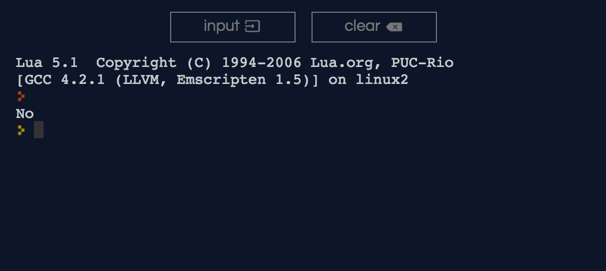

## Is LÖVE good for me?
Oh, boy. The answer is a retundous *YES* and *YES* love is necessary to thrive and experience life to its fullness.<br />
But, if you are talking about the *game framework love2d* it boils down to these three concepts in my opinion:

- What types of games you want to develop [Go to desirable goal](#what-types-of-games-you-can-develop?).
- Your current programming knowledge, if you have any [Go programming section](#programming-in-love2d-with-lua).
- And, if you want to get started with game development but you don't know how [Go to getting started](../#getting-started).

### What types of games you can develop?

LÖVE 2D is a great 2d framework, so, it is good with 2D games as its name states. You can also build 3D games but thats something for another topic. The love2d framework is capable of making any type of 2D currently available on the market if you have the time to develop and the appropriate libraries. But, in short the framework is capable of making any 2D game you can imagine.

Love2d is robust and fast to get started. Ideal for game jams with one or more people, and also for small projects because it allows you to build something really quick without using too many resources or extra tools like other frameworks.

### Programming in Love2d with Lua

Love2d uses. Lua is a powerful, efficient, lightweight, embeddable scripting language. It supports procedural programming, object-oriented programming, functional programming, data-driven programming, and data description. (Source: [Lua's website](https://www.lua.org/about.html)).

**But, what does that even mean?** - It is basically a very simple programming language that uses simple syntax or words to speak to the computer and produce a desirable result.

For example: Print to the screen "I am a plant."
Go to this page [repl.it](https://repl.it/languages/lua), and paste the following code on the left textarea and click *Run* to see the outcome. Ok, ready?

```lua
if true then
    print("No")
else
    print("I am a plant")
end
```

Now, you may have noticed that the previus example was actually a not what you expected, haha (?) because it will always print "No" as long as the word `true` is present in between the `if ... then` statements.



I was really tempted, sorry... The real code is the following:
```lua
print("I am a plant")
```

Or you could simply replace the word `true` with `false` and have the same outcome.

So, that's it?

Yes pretty sweet huh?. That is the power of Lua and compared to other languages it's incredibly straight forward.
Obviously, most applications are more complex than that, but if you have never coded before it's quite nice, belive me.